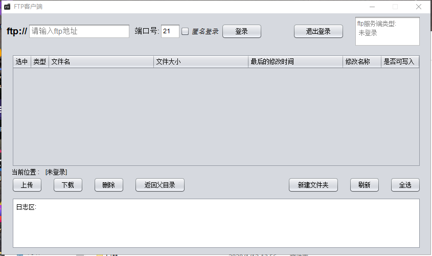

# FTP_Client
FTP客户端

### 效果如下 所示:

此图片位于result文件夹中,还有一个用exe4j转换形成的exe文件

#### 注意
项目中,bin目录下的resource和lib目录下的图片一致,因为需要打包成jar最终生成exe文件,
所以把lib目录下的图片复制一份到bin目录下了; 因为lib目录的图片在最终的exe文件中无法被
加载.

### 额外
本人新手,只会一点swing,不足之处请谅解; 希望和大佬们共同学习.
